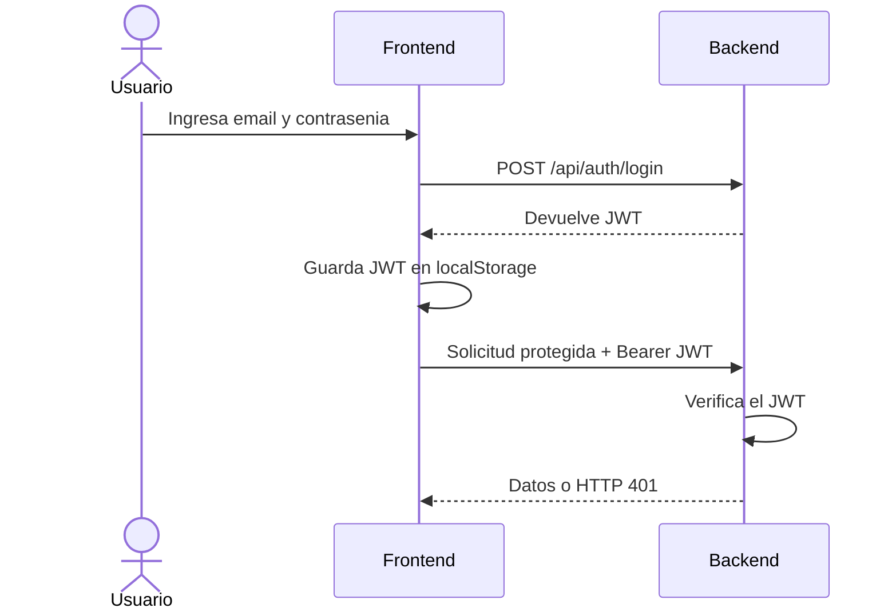
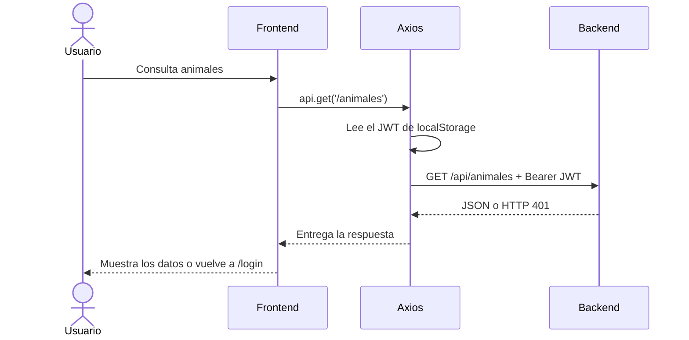

# fsd-challenge-cw
Prueba tecnica para puesto Full Stack Developer Jr.

Buscador de animales full-stack con registro, login, autenticacion mediante JWT,
filtros de busqueda y visualización de resultados en una tabla.

---

## Stack utilizado

* **Backend:** Node.js + Express
* **Frontend:** React + Vite
* **Persistencia:** MongoDB
* **Autenticacion:** bcrypt + JSON Web Token (JWT)

## Estructura del proyecto

* `backend/database/animals.json`: dataset inicial para cargar en MongoDB.
* `backend/src/models/users.js`: modelo de usuarios de MongoDB.
* `backend/src/models/animales.js`: modelo de animales de MongoDB.
* `backend/src/routes/authRoutes.js`: registro y login.
* `backend/src/routes/animalRoutes.js`: consulta y filtros de animales.
* `backend/src/middleware/authMiddleware.js`: validación del token.
* `frontend/src/pages/Login.jsx`: pantalla de login.
* `frontend/src/pages/Signup.jsx`: pantalla de registro.
* `frontend/src/pages/Animales.jsx`: buscador, tabla y logout.

---

## Instrucciones de ejecucion

### 1. Backend

```bash
cd backend
npm install
npm run seed
npm run dev
```

Antes de ejecutar los comandos, crear `backend/.env` y completa `MONGODB_URI` y `JWT_SECRET`.

El servidor queda alojado en `http://localhost:4000`.

### Tests del backend

```bash
cd backend
npm test
```

### 2. Frontend

En otra terminal:

```bash
cd frontend
npm install
npm run dev
```

El frontend queda indicado por Vite, normalmente
`http://localhost:5173`.

### Build de produccion

```bash
cd frontend
npm run build
```

---

## Endpoints

* `POST /api/auth/signup`: registra un usuario nuevo.
* `POST /api/auth/login`: valida las credenciales y devuelve un JWT.
* `GET /api/animales`: devuelve animales y requiere autenticación.
* `GET /api/animales/opciones`: devuelve las opciones disponibles para clase,
	dieta y continente; tambien requiere autenticación.

### Visualizacion de los diagramas

Para verlos en la vista previa de Markdown puede ser necesaria una extension compatible con Mermaid, como **Markdown Preview Mermaid Support**.

## Flujo de autenticación con JWT

El frontend guarda el JWT recibido en el login y lo envía en las solicitudes protegidas.



## Comunicacion del frontend con el backend mediante Axios

Axios define la URL base, agrega el token y devuelve la respuesta al frontend.



### Filtros de animales

Todos los filtros son opcionales y combinables:

* `nombre`: busqueda parcial por nombre común.
* `clase`: coincidencia exacta.
* `dieta`: coincidencia exacta.
* `continente`: coincidencia exacta.
* `pesoMin` y `pesoMax`: rango de peso promedio.
* `enPeligro`: `true` o `false`.

---

## Iteracion 1: Backend basico

Implementación de API REST con Express y persistencia con MongoDB.

* Lectura del dataset de animales desde MongoDB.
* Registro de usuarios en MongoDB.
* Validación de email y password.
* Hash de contraseñas usando bcrypt.
* Login con generación de token JWT.
* Endpoint de consulta de animales.

---

## Iteración 2: Frontend

Creación de la interfaz con React + Vite para consumir la API

* Pantalla de registro.
* Pantalla de login.
* Navegación usando Router.
* Cliente Axios con conexión a la API.
* Variable de carga y errores para feedback visual en los formularios.

---

## Iteración 3: Rutas protegidas y visualización de resultados

Se implemento el flujo de autenticación para filtrar.

* Ruta protegida `/animales`.
* Redirección al login cuando no existe una sesión.
* Envio del token en las peticiones con Axios.
* Redirección al login ante un token invalido o expirado.
* Filtros por nombre, clase, dieta, continente, peso y peligro de extinción.
* Tabla dinamica con los datos recibidos del backend.
* Feedback ante carga, errores y busqueda sin resultados.
* Logout eliminando el token del almacenamiento local.

---

## Iteración 4: Estilos basicos

Se agregaron estilos simples para mejorar la lectura y separar las secciones principales

* Header con titulo de la aplicación.
* Boton de logout en la ruta de `/api/animales`.
* Separación entre header, filtros y resultados.

---

## Iteración 5: Modularización y testing

Se reubica la logica para separar responsabilidades y mejorar la lectura y verificación del backend.

* Extracción de la logica de animales a `useAnimales.js`.
* Centralización del estado, filtros, opciones, errores y peticiones HTTP en un hook especifico.
* Creación de `PasswordInput.jsx` para reutilizar el campo de contraseña en login y signup.
* Sepación de la instanciación de Express en `src/app.js` y el listen del servidor en `src/index.js`.
* Uso de `node:test`, `node:assert` y `supertest`.
* Tests de validación de signup, login, autenticación con token y filtros.

---

## Decisiones y supuestos tecnicos

* La sesión se mantiene en `localStorage` con un token JWT.
* El logout se realiza del lado del cliente eliminando el token.
* Las contraseñas se persisten unicamente encriptadas.
* El filtro `nombre` es parcial, en cambio `clase`, `dieta` y `continente` son exactos.

## Limitaciones

* La persistencia depende de una instancia de MongoDB configurada mediante `MONGODB_URI`.
* Los animales deben cargarse inicialmente con `npm run seed`.

---

## Uso de Inteligencia Artificial

* **Herramienta:** Gemini como asistente de IA.
* **Alcance:** Asistencia en documentación e implementación de conexión a MongoDB, autenticación y rutas protegidas, estilos basicos, sintaxis de JS y recomendaciones de modularización.
* **Revisión:** Las propuestas fueron revisadas y adaptadas al codigo existente, validando el comportamiento esperado de la API y probando la interacción con el frontend.